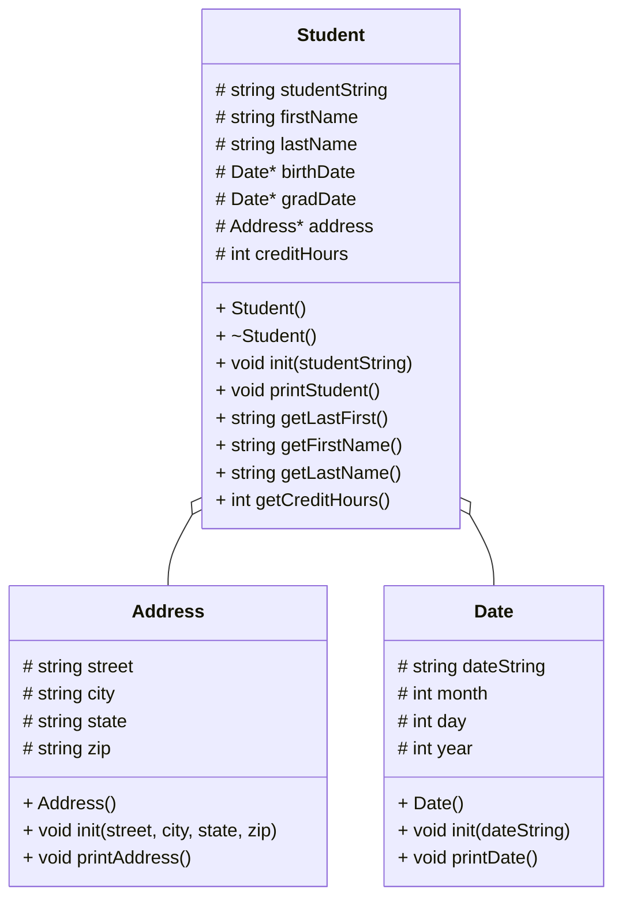

# CS121_Project_6_Beck
## (lab) Heap of students part 1



### class student()
```
in header:
  initialize strings studentString, firstName, lastName

  initialize integer creditHours
in constructor:
  go through each student
  initialize that student with firstName, lastName, birthDate, gradDate, address, and creditHours
  put firstName, lastName, birthDate, gradDate, address, and creditHours into studentString in the format fn,ln,a,bd,gd,ch
```

#### void init(studentString)
```
initialize studentString, firstName, lastName, street, city, state, zip, tBirthDate, tGradDate, and tCreditHours
```

#### void printStudent()
```
print studentString
```

#### string getLastFirst()
```
store first and last name as a string in the format last, first
```

#### string getFirstName()
```
store first name as a string
```

#### string getLastName()
```
store last name as a string
```

#### int getCreditHours()
```
store credit hours as an integer
```

### class address()
```
in header:
  initialize strings street, city, state, zip
in constructor:
  go through each student
  initialize that student with street, city, state, and zip
```

#### void init(street, city, state, zip)
```
initialize street, city, state, zip 
```

#### void printAddress()
```
print street, city, state, zip
```

### class date()
```
in header:
  initialize string dateString
  initialize integers month, day, year
in constructor:
  go through each student
  initialize that student with month, day, and year
  put month, day, and year into dateString in the format mm/dd/yyyy
```

#### void init(dateString)
```
intialize dateString, tMonth, tDay, tYear
```

#### void printDate()
```
print dateString
```