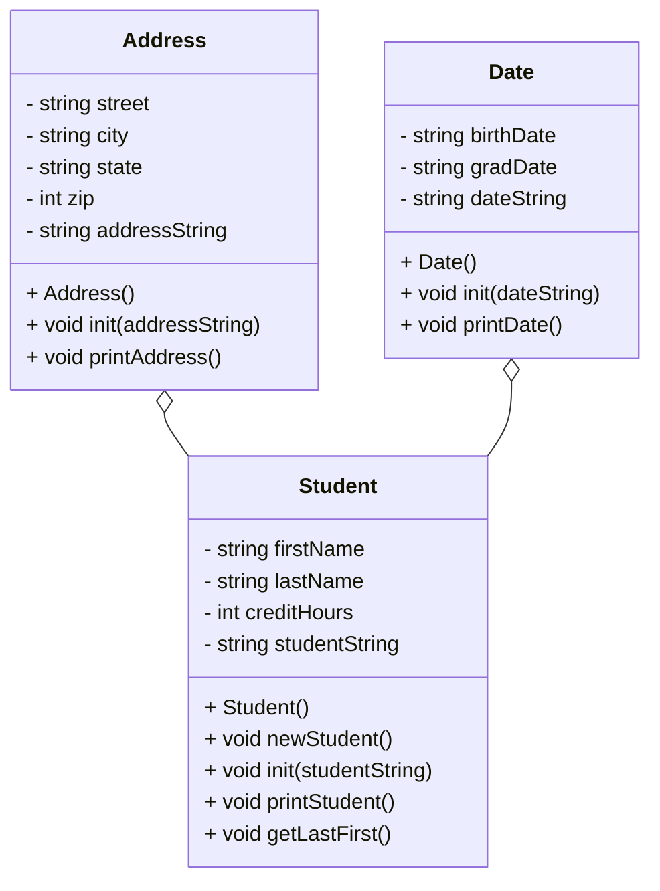

# CS121_Project_6_Beck
## (lab) Heap of students part 1

```mermaid
classDiagram
    class Student{
      - string firstName
      - string lastName
      - int creditHours
      - string studentString
      + Student()
      + void newStudent()
      + void init(studentString)
      + void printStudent()
      + void getLastFirst()
    }
    class Address{
      - string street
      - string city
      - string state
      - int zip
      - string addressString
      + Address()
      + void init(addressString)
      + void printAddress()
    }
    class Date{
      - string birthDate
      - string gradDate
      - string dateString
      + Date()
      + void init(dateString)
      + void printDate()
    }

Address o-- Student
Date o-- Student
```