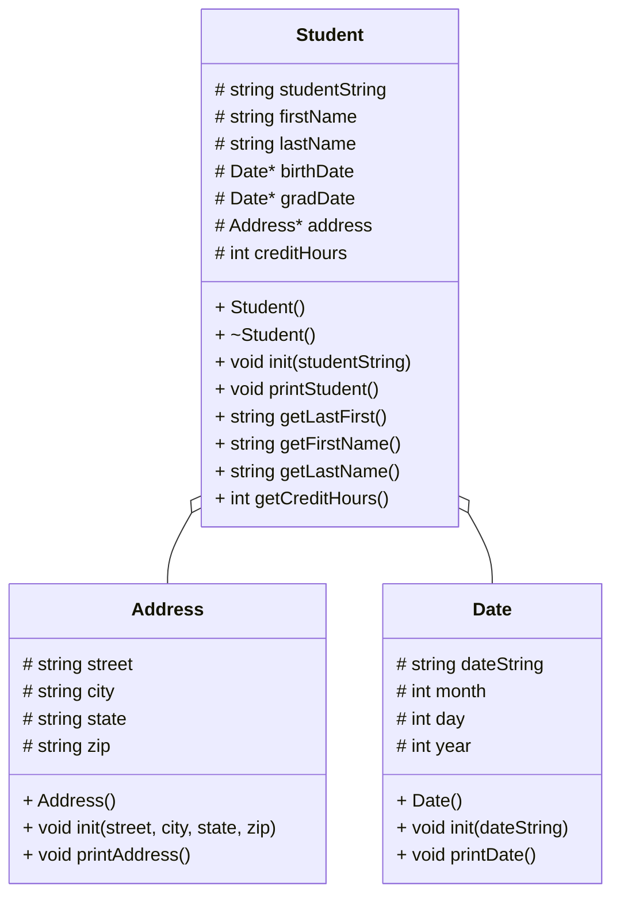

# CS121_Project_6_Beck
## (lab) Heap of students part 1



### main()
```
Load up the vector from students.csv
Until the user wants to quit:
  Print the menu
  Perform tasks based on user input
Clear the students vector
```

#### loadStudents(students vector)
```
Open students.csv
For each line of the file:
  Create a Student instance on the heap
  Initialize that instance with the string from the csv file
  Append that instance to the vector at the end
Close the file
```

#### printStudents(students vector)
```
For each line of students.csv:
  Print out all data for each student
```

#### showStudentNames(students vector)
```
For each line of students.csv:
  Print out the last name and first name of each student
```

#### findStudent(students vector)
```
Print "Enter last name of student: "
Store input in string lastNameRequest
Check lastNameRequest against the data file using string.find()
Print any lastNames that match lastNameRequest
```

#### delStudents(students vector)
```
For each element in the students vector:
  Delete that element
```

#### menu()
```
Print a menu with options quit, print all student names, print all student data, and find a student
Print "Select 0-3: "
Store input in string menuRequest
Based on input, send user to delStudents, printStudents, showStudentNames, or findStudent
```

### class student()
```
in header:
  initialize strings studentString, firstName, lastName
  send birthDate to the Date class
  send gradDate to the Date class
  send address to the Address class
  initialize integer creditHours
in constructor:
  go through each student
  initialize that student with firstName, lastName, birthDate, gradDate, address, and creditHours
  put firstName, lastName, birthDate, gradDate, address, and creditHours into studentString in the format fn,ln,a,bd,gd,ch
```

#### void init(studentString)
```
initialize studentString, firstName, lastName, street, city, state, zip, tBirthDate, tGradDate, and tCreditHours
```

#### void printStudent()
```
print studentString
```

#### string getLastFirst()
```
store first and last name as a string in the format last, first
```

#### string getFirstName()
```
store first name as a string
```

#### string getLastName()
```
store last name as a string
```

#### int getCreditHours()
```
store credit hours as an integer
```

### class address()
```
in header:
  initialize strings street, city, state, zip
in constructor:
  go through each student
  initialize that student with street, city, state, and zip
```

#### void init(street, city, state, zip)
```
initialize street, city, state, zip 
```

#### void printAddress()
```
print street, city, state, zip
```

### class date()
```
in header:
  initialize string dateString
  initialize integers month, day, year
in constructor:
  go through each student
  initialize that student with month, day, and year
  put month, day, and year into dateString in the format mm/dd/yyyy
```

#### void init(dateString)
```
intialize dateString, tMonth, tDay, tYear
```

#### void printDate()
```
print dateString
```